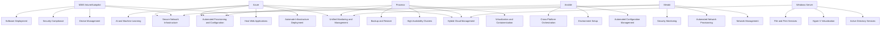

```mermaid
graph TD
    A[Azure]
    B[Automate Infrastructure Deployment]
    C[Host Web Applications]
    D[AI and Machine Learning]
    E[M365 Intune/Autopilot]
    F[Device Management]
    G[Security Compliance]
    H[Software Deployment]
    I[Ansible]
    J[Automated Configuration Management]
    K[Environment Setup]
    L[Cross-Platform Orchestration]
    M[Proxmox]
    N[Virtualization and Containerization]
    O[High Availability Clusters]
    P[Backup and Restore]
    Q[Meraki]
    R[Network Management]
    S[Automated Network Provisioning]
    T[Security Monitoring]
    U[Windows Server]
    V[Active Directory Services]
    W[Hyper-V Virtualization]
    X[File and Print Services]
    Y[Hybrid Cloud Management]
    Z[Automated Provisioning and Configuration]
    AA[Secure Network Infrastructure]
    AB[Unified Monitoring and Management]

    A --> B
    A --> C
    A --> D
    E --> F
    E --> G
    E --> H
    I --> J
    I --> K
    I --> L
    M --> N
    M --> O
    M --> P
    Q --> R
    Q --> S
    Q --> T
    U --> V
    U --> W
    U --> X
    A --> Y
    M --> Y
    U --> Y
    I --> Z
    A --> Z
    E --> Z
    M --> Z
    A --> AA
    E --> AA
    Q --> AA
    A --> AB
    M --> AB
    Q --> AB


```
